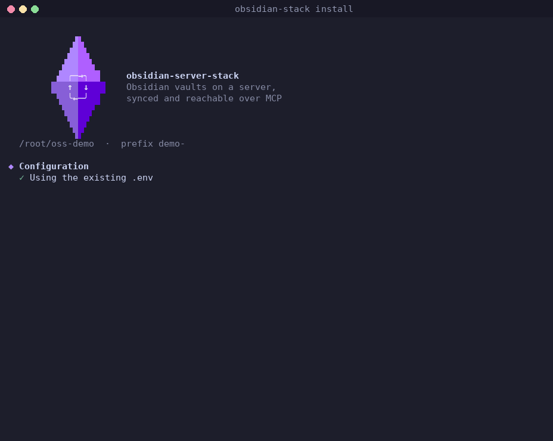

<p align="center">
  <picture>
    <source media="(prefers-color-scheme: dark)" srcset="assets/logo-dark.gif">
    
  </picture>
</p>

<h1 align="center">Obsidian Server Stack</h1>

<p align="center">An Obsidian vault on a server, synced across devices and reachable over MCP.</p>

<p align="center">
  <a href="https://github.com/Jacob-Stokes/obsidian-server-stack/actions/workflows/build.yml"></a>
  <a href="https://jacob-stokes.github.io/obsidian-server-stack/"></a>
  <a href="LICENSE"></a>
</p>

An Obsidian vault is a good long-term memory for AI tools: notes, plans, research, journals, all in plain markdown. But most Obsidian MCP servers run on a personal computer, and many need the Obsidian app open, so the notes disappear whenever that machine sleeps. That rules out AI tools on a phone, web-based clients, and agents that run on a schedule.

This stack keeps the vault on an always-on server instead. Devices go on syncing with Obsidian as usual, and any MCP client can read and write the same notes over HTTP, at any hour.

<p align="center">
  
</p>

## Features

**Works with the sync already in use.** Each vault syncs in its own way: self-hosted LiveSync (free, end-to-end encrypted, set up on devices with a Setup URI), Official Obsidian Sync, or git. One server can hold several vaults, mixing sync methods and accounts, each with its own settings.

**Thorough note tools.** Read, search, write and edit notes; frontmatter, tags, links and backlinks; daily notes; attachments; bulk changes across many files. Notes stay plain markdown, edited in place, so every device sees the changes through its normal sync.

**Careful with the vault.** Edits can check that a note hasn't changed since it was read, so nothing written on a phone a minute ago gets overwritten. Deletions go to the vault's trash, bulk changes can be previewed first, and Obsidian's settings folder is out of reach.

**Headless and light.** No Obsidian app or virtual machine: a few small containers, about 230 MB of RAM for a server with three vaults.

**The full app when needed.** An optional add-on runs the real Obsidian app per vault, which lets AI tools run community plugins and commands, query Bases, and take screenshots of canvases and plugin views. With Official Sync, plugins and settings come from the other devices.

**Managed from AI tools, too.** Another optional add-on lets an AI client add vaults, check sync and hand out Setup URIs, through a fixed set of checked operations.

**Reachable safely.** The MCP listens on localhost, with a bearer token and optional OAuth login, ready to put behind Tailscale, Cloudflare Tunnel or a reverse proxy.

## Install

Two ways, running the same containers. Requires Linux with Docker (Compose v2).

**Installer**, for most setups: asks a few questions, adds vaults and makes Setup URIs for devices. Everything runs as one Docker Compose project in the install folder, managed with the `obsidian-stack` command or plain `docker compose`.

```bash
git clone https://github.com/Jacob-Stokes/obsidian-server-stack.git
cd obsidian-server-stack
./install.sh
```

**Docker Compose**, for servers where everything is a compose file: [`examples/compose.yml`](examples/compose.yml) builds the services straight from this repository, with no installer. See [Docker Compose](https://jacob-stokes.github.io/obsidian-server-stack/compose/).

The MCP endpoint is then `http://localhost:7002/mcp`, with its bearer token in `.env`.

## Documentation

**[jacob-stokes.github.io/obsidian-server-stack](https://jacob-stokes.github.io/obsidian-server-stack/)**

- [How it works](https://jacob-stokes.github.io/obsidian-server-stack/how-it-works/): vaults, containers and sync sources
- [Self-hosted LiveSync](https://jacob-stokes.github.io/obsidian-server-stack/livesync/): devices, Setup URIs, HTTPS for phones
- [Managing with obsidian-stack](https://jacob-stokes.github.io/obsidian-server-stack/managing/) and [connecting to the MCP](https://jacob-stokes.github.io/obsidian-server-stack/mcp/)
- Optional: the [Obsidian app](https://jacob-stokes.github.io/obsidian-server-stack/obsidian-app/) for plugins, Bases and screenshots, and [managing the stack from AI tools](https://jacob-stokes.github.io/obsidian-server-stack/ai-management/)

## License

MIT. The CouchDB setup in `sync/couchdb` is adapted from [obsidian-livesync](https://github.com/vrtmrz/obsidian-livesync), also MIT. Obsidian's sync client, [obsidian-headless](https://www.npmjs.com/package/obsidian-headless), is installed from npm when the image is built and isn't included in this repo. See [THIRD_PARTY_NOTICES.md](THIRD_PARTY_NOTICES.md).
