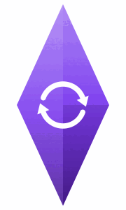

<p align="center">
  <picture>
    <source media="(prefers-color-scheme: dark)" srcset="assets/logo-dark.gif">
    
  </picture>
</p>

<h1 align="center">Obsidian Server Stack</h1>

<p align="center">An Obsidian vault on a server, synced across devices and reachable over MCP.</p>

<p align="center">
  <a href="https://github.com/Jacob-Stokes/obsidian-server-stack/actions/workflows/build.yml"></a>
  <a href="LICENSE"></a>
</p>

Most Obsidian MCP servers run on a personal computer, and many also need the Obsidian app open, so the vault is unreachable whenever that machine is off. This stack keeps copies of one or more vaults on an always-on server instead, each synced with other devices in its own way and all reachable by any MCP client over HTTP. It runs headless: no Obsidian app or virtual machine, just a few small containers and the notes as plain markdown files.

## Install

```bash
git clone https://github.com/Jacob-Stokes/obsidian-server-stack.git
cd obsidian-server-stack
./install.sh
```

Requires Linux with Docker (Compose v2), `openssl` and `curl`, plus `ssh-keygen` for git sync. Run as root or with sudo.

The installer generates secrets, starts the core containers, adds a first vault, and offers to put an `obsidian-stack` command on the PATH for managing the install afterwards. Once finished, the MCP endpoint is at `http://localhost:7002/mcp`, with its bearer token in `.env`.

## How it works

One install serves any number of vaults. Each vault is a folder of markdown files, `vaults/<id>/`, where the id comes from its name (`Work Notes` becomes `work-notes`). The list of vaults is `vaults/.registry.json`, managed by `obsidian-stack`.

Two containers serve every vault:

| Container | Job |
|---|---|
| `obsidian-mcp` | MCP server, the endpoint clients connect to. One bearer token covers every vault in the install. |
| `obsidian-api` | REST API over the vault folders. Only `obsidian-mcp` can reach it. Each request names its vault, and the vault list is re-read on every request, so vaults can be added or removed without a restart. |

MCP clients call `obsidian_list_vaults` to see the vaults, then pass a `vault_id` to every other tool. With a single vault the id can be left out; the server says which case applies when a client connects.

Each vault stays in sync with other devices on its own, with its own sync source, its own containers, and its own settings and credentials in `state/<id>/`:

| Source | Containers per vault | On other devices | Cost |
|---|---|---|---|
| Self-hosted LiveSync | `obsidian-<id>-livesync`, plus one shared `obsidian-couchdb` | [Self-hosted LiveSync](https://github.com/vrtmrz/obsidian-livesync) plugin, set up from a generated Setup URI | Free |
| Existing LiveSync server | `obsidian-<id>-livesync` | An existing LiveSync setup, joined via Setup URI | Free |
| Official Obsidian Sync | `obsidian-<id>-official-sync` ([obsidian-headless](https://github.com/obsidianmd/obsidian-headless)) | Obsidian Sync | [Subscription](https://obsidian.md/sync) |
| Git | `obsidian-<id>-git-sync` | [obsidian-git](https://github.com/Vinzent03/obsidian-git) plugin | Free |
| None | | `vaults/<id>/` is managed manually | Free |

Because credentials are per vault, one install can mix sources and accounts: two vaults on different Obsidian Sync accounts, one on git, another joining a LiveSync server elsewhere, and so on.

### Self-hosted LiveSync

Self-hosted LiveSync vaults share one CouchDB server, with a database per vault. Each vault is end-to-end encrypted, with obfuscated file paths, so CouchDB only holds ciphertext.

Devices are set up with a Setup URI, made by the LiveSync project's own generator. Adding the vault prints one, with its passphrase, and `obsidian-stack setup-uri <id>` prints another at any time. The URIs don't expire, any number of devices can use the same one, and every URI for a vault carries the same encryption passphrase and settings, so a device added months later joins the same vault. On each device: install the plugin, choose "Use the copied setup URI" (or open the URI on the device), and enter the passphrase. Devices sync every 60 seconds by default; switching the plugin's sync mode to LiveSync makes it real time. The server's own copy always runs in LiveSync mode, so MCP writes reach CouchDB within seconds.

### Phones and HTTPS

Obsidian on iOS and Android only connects to servers over `https://`. Both operating systems block plain `http://` from the app, and the block applies to every network, including a Tailscale tailnet or a home Wi-Fi network. Obsidian desktop accepts `http://`.

This matters only for self-hosted LiveSync, the one source where devices connect to this server:

| Source | What devices connect to | HTTPS needed on this server |
|---|---|---|
| Self-hosted LiveSync | This server's CouchDB (port 5984) | Yes, for phones |
| Existing LiveSync server | That server | No (that server's own address) |
| Official Obsidian Sync | Obsidian's servers, already HTTPS | No |
| Git | The git host, already HTTPS or SSH | No |

To give CouchDB an HTTPS address, `sync/couchdb` has optional profiles for [Tailscale](https://tailscale.com) (an `https://<name>.<tailnet>.ts.net` address, private to the tailnet), [Caddy](https://caddyserver.com) (a domain with automatic certificates) and [Cloudflare Tunnel](https://developers.cloudflare.com/cloudflare-one/connections/connect-networks/) (a domain, no open ports); see [sync/couchdb](sync/couchdb/README.md). An existing reverse proxy pointed at port 5984 works too. The address devices use is asked for when the first self-hosted LiveSync vault is added and goes into each Setup URI; `obsidian-stack setup-uri <id> --url` changes it and prints a new URI.

## Managing

`obsidian-stack` manages one install: adding and removing vaults, checking sync, reading logs. Run with no arguments, it opens an interactive menu.

| Command | Does |
|---|---|
| `obsidian-stack` | Interactive menu |
| `obsidian-stack status` | Core containers, and each vault's sync state and note count |
| `obsidian-stack vaults` | List vaults |
| `obsidian-stack add` / `remove [id]` | Add a vault, or remove one (its files are kept) |
| `obsidian-stack app enable\|disable <id>` | The optional Obsidian app for a vault (below) |
| `obsidian-stack setup-uri <id> [--url]` | Setup URI for a self-hosted LiveSync vault's devices; `--url` changes the address they connect to |
| `obsidian-stack logs <id\|api\|mcp\|couchdb> [-f]` | Logs for a vault's sync or a core container |
| `obsidian-stack restart <id\|api\|mcp\|couchdb\|all>` | Restart one part, or everything |
| `obsidian-stack update` | `git pull`, rebuild, and restart everything on the new version |
| `obsidian-stack endpoint [--show-token]` | MCP URL and bearer token |
| `obsidian-stack link [name]` | Add the command to `/usr/local/bin` |
| `obsidian-stack uninstall [--yes]` | Remove the install's containers, images and command; notes are kept unless chosen |

The command always acts on the install it belongs to: the folder it lives in (following the link on the PATH), or one given with `--dir` or `$OBSIDIAN_STACK_DIR`. Every container the stack creates carries a Docker label with the install's `STACK_ID` from `.env`, and the command finds containers by that label rather than by name, so other Obsidian containers on the machine are never affected.

## Obsidian app (optional)

Everything above works on plain markdown files, with no Obsidian app on the server. Some things only the app can do: running community plugins such as [Linter](https://github.com/platers/obsidian-linter) or [Templater](https://github.com/SilentVoid13/Templater), or any command from the command palette. For those, `obsidian-stack app enable <id>` adds the full Obsidian app for one vault:

- **In a browser tab:** [LinuxServer.io's Obsidian image](https://docs.linuxserver.io/images/docker-obsidian/) runs the desktop app on the server, at `http://localhost:7300` behind a generated login (in `state/<id>/app.env`). Like the MCP, it listens on localhost only.
- **Driven by the MCP:** a small service in the same container works through the [official Obsidian CLI](https://obsidian.md/help/cli). Four tools appear for vaults with the app:

| Tool | Does |
|---|---|
| `obsidian_app_commands` | List commands, including plugins' commands (pass a note to see the ones that act on a note) |
| `obsidian_app_run_command` | Run a command, optionally on a given note |
| `obsidian_app_plugins` | Search the community directory; install, update, uninstall, enable and disable plugins; read and change each plugin's settings |
| `obsidian_app_appearance` | Search, install and switch themes; create, enable, disable and delete CSS snippets |

- **Same files, no extra sync:** the app opens `vaults/<id>/` and doesn't sync by itself. The vault's own sync keeps that folder current, and the app picks up changes on disk. Its own sync (LiveSync plugin or Obsidian Sync) is best left off, as it would be a second sync client on the same folder.
- **Plugins from the other devices (Official Sync):** for an Official Sync vault, enabling the app offers to turn on settings sync as well. The other devices' community plugins, their settings, theme and hotkeys then come to the server, and the app runs them. Like the notes, it's two-way: plugin changes made on the server reach every device. So the same step asks whether the MCP may change plugins, and leaves them read-only unless told otherwise.

Enabling it asks whether to turn off Obsidian's restricted mode, which otherwise keeps community plugins from running. Plugins are code from their authors, and with restricted mode off they run on the server with access to the vault. Two settings in `state/<id>/app.env` limit what the MCP may do: `APP_COMMANDS` lists the commands it may run (for example `obsidian-linter:*,editor:*`), and `APP_EXTENSIONS=read` lets it see plugins, themes and snippets but not change them. Arbitrary JavaScript (`eval`) is never exposed. `obsidian-stack app run <id> <command>` runs any Obsidian CLI command directly, e.g. `plugins:restrict off`.

It costs about 350 MB of RAM per vault while idle, more while the browser tab is open, plus a 1.3 GB image. If Obsidian exits, including when its window is closed in the browser, it is reopened within about 30 seconds.

## Running a second instance

Multiple vaults and multiple sync accounts fit in one install. A second, separate install is for vaults that need their own MCP endpoint and token, for example one set for one person or agent and another set for another, since a token sees every vault in its install. It's also a way to try a new version alongside a working one.

Give the second install its own prefix and port before running `./install.sh`:

```bash
cp .env.example .env
sed -i 's/^INSTANCE_PREFIX=.*/INSTANCE_PREFIX=test-/; s/^MCP_PORT=.*/MCP_PORT=7102/' .env
```

Its containers, networks and volumes get the prefix, and its command is named after it, e.g. `obsidian-stack-test`. If both use self-hosted LiveSync, the second also needs a different `COUCHDB_PORT` in `sync/couchdb/.env`.

## Reaching the MCP

The MCP listens on `localhost:7002` only. Remote access is left to an existing tool, such as:

- [Tailscale Serve](https://tailscale.com/kb/1312/serve): private to the tailnet. `tailscale serve --bg 7002`
- [Tailscale Funnel](https://tailscale.com/kb/1223/funnel): public URL, needed for web-based clients. `tailscale funnel --bg 7002`
- [Cloudflare Tunnel](https://developers.cloudflare.com/cloudflare-one/connections/connect-networks/): public URL on a custom domain, no open ports
- A reverse proxy such as [Caddy](https://caddyserver.com) or [nginx](https://nginx.org), if the server has a public IP

Clients authenticate with `Authorization: Bearer <MCP_BEARER_TOKEN>`. For clients that require an OAuth login, set the `MCP_OAUTH_*` values in `.env`. A public endpoint is protected only by that token.

## Updating and uninstalling

To update, run `obsidian-stack update`. The `.env`, vaults and sync settings are preserved, and every vault's sync is restarted on the new version.

To remove one vault, run `obsidian-stack remove <id>`. Its notes stay in `vaults/<id>/` and its settings in `state/<id>/` until deleted by hand.

To uninstall, run `obsidian-stack uninstall`. It removes every container labelled with the install's `STACK_ID`, its network, built images and `obsidian-stack` command, then asks separately whether to delete the CouchDB databases and the notes, settings and `.env`. Both are kept unless chosen; devices keep their own copies either way. `obsidian-stack uninstall --yes` skips the prompts and keeps everything on disk.

## Tools

All tool names start with `obsidian_`. Every tool except `list_vaults` takes a `vault_id`. With a single vault it can be omitted, and the server says so when a client connects; with several, an omitted id is refused with the list of vaults.

| Group | Tools |
|---|---|
| Vaults | `list_vaults` (id, name and sync source of each vault; optional search) |
| Read | `get_note`, `list_notes`, `search_notes`, `links`, `status` |
| Write | `write_note`, `append_to_note`, `patch_note`, `replace_in_note` |
| Organise | `move_note`, `delete_note` (moves to `.trash`), `bulk` |
| Metadata | `manage_frontmatter`, `manage_tags` |
| Other | `daily` (daily notes), `attachments` (non-markdown files) |

## License

MIT. The CouchDB setup in `sync/couchdb` is adapted from [obsidian-livesync](https://github.com/vrtmrz/obsidian-livesync), also MIT. Obsidian's sync client, [obsidian-headless](https://www.npmjs.com/package/obsidian-headless), is installed from npm when the image is built and isn't included in this repo. See [THIRD_PARTY_NOTICES.md](THIRD_PARTY_NOTICES.md).
